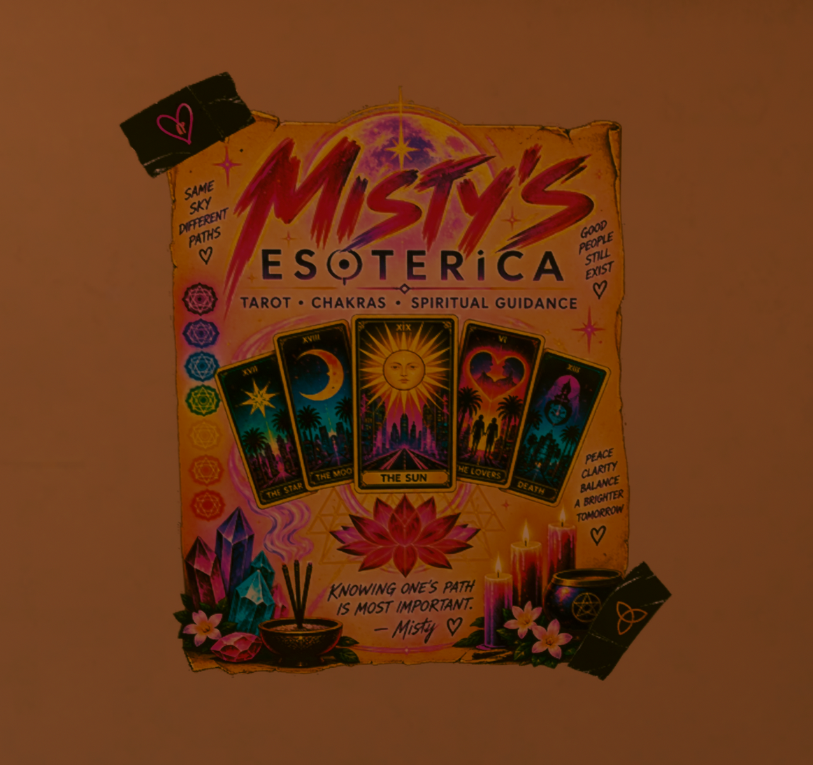

<div align="center">



# Misty's Esoterica Poster - H10 Bathroom

**Bring some color, light, and spiritual energy into V's H10 apartment.**


</div>

---

This mod replaces the vanilla shower/toilet directional arrows in V's H10 bathroom with a custom Misty's Esoterica advertisement, inspired by Misty's spiritual shop in Night City.

The poster was designed to reflect Misty's bright and hopeful personality, using colorful tarot imagery, chakras, crystals, candles, flowers, and spiritual symbolism rather than the darker aesthetic often associated with Night City.

The original bathroom decal placement is retained, allowing the poster to integrate naturally into V's apartment while giving the otherwise plain bathroom wall a completely different personality.

<p align="center">
  
</p>

---

## Features

- Custom Misty's Esoterica advertisement
- Colorful tarot, chakra, crystal, and spiritual imagery
- Replaces the H10 bathroom shower/toilet directional arrows
- Designed to blend naturally with Cyberpunk 2077's visual style
- Uses the existing in-game decal placement
- Updated and tested with Cyberpunk 2077 2.31
- No scripts
- No CET required
- No additional dependencies

---

## Installation

Install with Vortex, or manually place the included `.archive` file into:

```text
Cyberpunk 2077\archive\pc\mod
```

---

## Uninstallation

Remove the mod through Vortex, or delete its `.archive` file from:

```text
Cyberpunk 2077\archive\pc\mod
```

The original shower/toilet directional arrows will return.

---

## Compatibility

This mod replaces the H10 bathroom's:

```text
shower_toilet_sign
```

material/texture.

Any other mod replacing the same bathroom sign will conflict. Use only one replacement for this decal at a time.

---

## Credits

Created by Big2What.

Built and tested using WolvenKit for Cyberpunk 2077 2.31.
